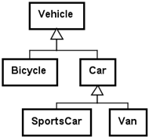
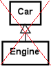

# Chapter 12 – Inheritance

## 1. Introduction

Session 12 introduces inheritance.

Inheritance allows classes to share common responsibility and behavior.

The goal is to model:

> "is-a" relationships

Inheritance supports:

- code reuse
- avoiding duplication
- specialization
- simpler maintenance
- clearer object-oriented design

Inheritance is one of the central mechanisms in object-oriented programming.

---

## 2. The "Is-A" Relationship

Inheritance models:

> is-a

Examples:

```text
Car is a Vehicle
```

```text
Van is a Car
```

```text
SportsCar is a Car
```

```text
Bicycle is a Vehicle
```

A subclass is a more specialized version of a superclass.

Example:



---

## 3. Superclass and Subclass

Inheritance introduces two concepts.

### Superclass

The general class.

Example:

```text
Vehicle
```

Responsible for common properties:

- owner
- price

---

### Subclass

More specialized classes.

Example:

```text
Car
```

Additional responsibility:

- registration number

Example:

```text
Van
```

Additional responsibility:

- max load

The superclass handles general responsibility.

The subclass handles specialized responsibility.

---

## 4. Avoiding Duplication

Without inheritance:

```text
Car
- owner
- price
- regNo

Van
- owner
- price
- regNo
- maxLoad

SportsCar
- owner
- price
- regNo
- maxVelocity
```

Notice repeated information:

- owner
- price

Inheritance removes duplication.

Better design:

```text
Vehicle
- owner
- price

Car extends Vehicle
- regNo

Van extends Car
- maxLoad

SportsCar extends Car
- maxVelocity
```

---

## 5. Extending a Class

Example:

```java
public class Car extends Vehicle
{
}
```

Keyword:

```java
extends
```

means:

> Car is a Vehicle

The subclass automatically inherits superclass behavior.

---

## 6. Constructor Responsibility

Superclass establishes superclass state.

Example:

```java
public class Vehicle
{
  private String owner;
  private double price;

  public Vehicle(String owner,
                 double price)
  {
    this.owner = owner;
    this.price = price;
  }
}
```

Subclass establishes subclass state.

Example:

```java
public class Car
  extends Vehicle
{
  private String regNo;

  public Car(String owner,
             double price,
             String regNo)
  {
    super(owner, price);

    this.regNo = regNo;
  }
}
```

---

## 7. The super Keyword

`super(...)` calls the superclass constructor.

Example:

```java
super(owner, price);
```

Meaning:

> Let Vehicle establish Vehicle state.

Then:

```java
this.regNo = regNo;
```

establishes Car state.

Responsibility remains separated.

---

## 8. Constructor Responsibility Principle

Superclass constructor:

```text
Establish superclass state
```

Subclass constructor:

```text
Establish subclass state
```

Example:

Vehicle establishes:

- owner
- price

Car establishes:

- regNo

Good responsibility design remains important.

---

## 9. Method Lookup

Objects may call inherited methods.

Example:

```java
Vehicle v =
    new Car("Bob",
            125000,
            "BZ41377");
```

Call:

```java
v.toString()
```

Java searches:

1. Car
2. Vehicle
3. Object

The closest implementation is used.

---

## 10. Overriding Methods

Subclasses may provide specialized behavior.

Example idea:

Superclass:

```java
public String toString()
{
  return "Owner=" + owner;
}
```

Subclass:

```java
public String toString()
{
  return super.toString()
       + ", regNo=" + regNo;
}
```

The subclass extends behavior.

---

## 11. Calling Superclass Methods

Example:

```java
super.toString()
```

Meaning:

> Use superclass implementation first.

Then add specialized information.

Example output:

```text
Owner=Bob,
price=125000,
regNo=BZ41377
```

This reduces duplication.

---

## 12. equals and Inheritance

Superclass equality:

```java
public boolean equals(
    Object obj)
{
  // compare superclass fields
}
```

Subclass equality:

```java
return super.equals(obj)
    && regNo.equals(
           other.regNo);
```

Superclass compares:

- owner
- price

Subclass compares:

- regNo

Responsibility remains layered.

---

## 13. References and Polymorphism

Example:

```java
Vehicle v =
    new Car(
        "Bob",
        125000,
        "BZ41377");
```

Reference type:

```text
Vehicle
```

Actual object:

```text
Car
```

A superclass reference may reference subclass objects.

This becomes increasingly important later.

---

## 14. Class Object

All Java classes inherit from:

```text
Object
```

Even:

```java
public class Vehicle
```

implicitly means:

```java
public class Vehicle
    extends Object
```

All classes are direct or indirect subclasses of `Object`.

---

## 15. Abstract Classes

Sometimes a class is too general.

Example:

```text
Vehicle
```

Question:

Should it make sense to create:

```java
new Vehicle("Bob", 200)
```

Sometimes the answer is:

> No

---

## 16. Abstract Class

Example:

```java
public abstract class
TwoDimensionalShape
{
}
```

Keyword:

```java
abstract
```

means:

> This class is incomplete or too general.

Abstract classes cannot be instantiated.

Illegal:

```java
TwoDimensionalShape s =
    new TwoDimensionalShape();
```

Compiler error.

---

## 17. Abstract Methods

Example:

```java
public abstract double
getArea();
```

Abstract methods:

- have no implementation
- force subclasses to implement behavior

Example:

```text
Shape
 ├── Circle
 └── Triangle
```

Each subclass provides:

```java
getArea()
```

differently.

---

## 18. Overriding Abstract Methods

Example idea:

```java
public double getArea()
{
  return radius
       * radius
       * Math.PI;
}
```

The subclass completes the superclass contract.

---

## 19. Private versus Protected

Example:

```java
private String owner;
```

Private fields:

- protect object state
- improve encapsulation

Alternative:

```java
protected String owner;
```

Protected allows subclass access.

Course recommendation:

Prefer:

```java
private
```

Use public methods for access.

Example:

```java
getOwner()
```

Encapsulation remains important.

---

## 20. Responsibility and Inheritance

Superclass:

```text
General responsibility
```

Subclass:

```text
Specialized responsibility
```

Inheritance should model meaningful specialization.

Good:


Bad:



That is not inheritance.

It is:

```text
has-a
```

---

## 21. Typical Beginner Mistakes

Common mistakes:

1. Using inheritance for has-a relationships
2. Duplicating superclass fields
3. Forgetting `super(...)`
4. Overriding unnecessarily
5. Making everything abstract
6. Using inheritance instead of composition
7. Violating responsibility boundaries
8. Confusing superclass references with objects

---

## 22. Reflection Questions

- What is an "is-a" relationship?
- When should inheritance be used?
- Why call `super(...)`?
- What is the responsibility of the superclass?
- What is the responsibility of the subclass?
- Why have abstract classes?
- Why prefer private fields?

---

## Summary

Session 12 introduces inheritance.

Important ideas:

- inheritance models "is-a"
- superclass = general responsibility
- subclass = specialized responsibility
- `extends` creates inheritance
- `super(...)` establishes superclass state
- subclasses may override methods
- abstract classes model incomplete or general concepts
- inheritance reduces duplication
- encapsulation remains important

Inheritance allows objects to become increasingly specialized while keeping responsibility organized.
